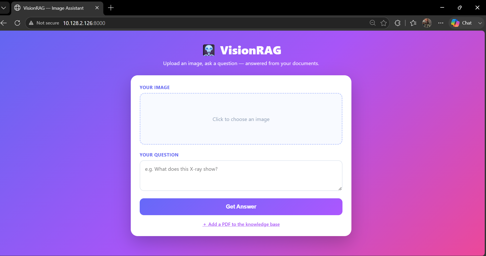
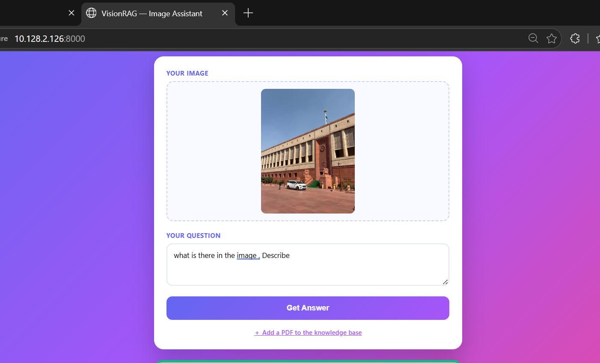
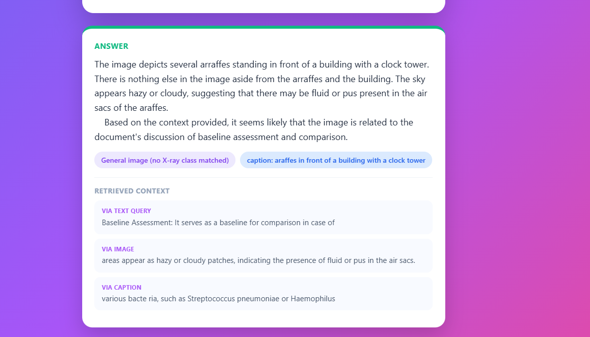
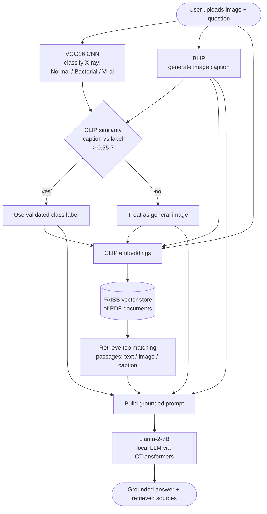

<h1 align="center">🩻 MMVA — Multimodal Vision Assistant</h1>

<p align="center">
  MMVA is an offline, decentralized multimodal assistant that answers questions about an image
  by combining computer vision with a locally-run large language model. It classifies and captions
  the image, retrieves supporting passages from your own documents, and generates a grounded answer
  entirely on-device — no external APIs, so your data stays private.
</p>

<p align="center">
  
  
  
  
  
  
</p>

<!-- App screenshot -->
<p align="center">
  
</p>

---

## 🎥 Demo

Because MMVA runs a **7B-parameter Llama-2 model fully offline** (alongside VGG16,
CLIP, and BLIP), it needs ~8 GB of RAM and is designed to run locally rather than
on a free cloud tier. A short walkthrough is below; full setup takes a few minutes.

<p align="center">
  
  &nbsp;
  
</p>

---

## 🌟 Overview

MMVA answers questions about an image by combining **computer vision**, **retrieval**,
and a **local large language model**. Given an image and a question, it:

1. Classifies the image (e.g. a chest X-ray) with a fine-tuned CNN.
2. Describes the image in natural language with an image-captioning model.
3. Validates that the classification and the caption agree.
4. Embeds the question, the image, and the caption, and retrieves the most relevant
   passages from a document knowledge base.
5. Feeds everything to a locally-run Llama-2 model, which generates a grounded answer.

Everything runs on-device — the "decentralized, offline" design means **no data
leaves the machine** and there is **no dependency on any external API**.

---

## 🌟 Key Features

* **Multimodal input** — reasons over an image and a text question together.
* **Retrieval-Augmented Generation (RAG)** — grounds answers in your own PDF
  documents via a FAISS vector store, rather than relying on the model's memory.
* **Medical image classification** — a VGG16 CNN classifies chest X-rays as
  Normal, Bacterial, or Viral cases.
* **Cross-checked vision** — the image caption and the CNN label are compared with
  CLIP similarity to filter out low-confidence or mismatched predictions.
* **Fully offline & private** — a quantized Llama-2-7B runs locally through
  CTransformers; no API keys, no external calls.
* **Extensible knowledge base** — upload a new PDF from the UI to rebuild the
  vector store on the fly.

---

## 🧠 How It Works

MMVA is a pipeline of specialized models that hand off to one another. The final
answer is produced by the Llama-2 model, but only after the image has been
classified, captioned, validated, and used to retrieve supporting context.



### The models involved

| Stage | Model | Role |
| :--- | :--- | :--- |
| Classification | **VGG16** (TensorFlow) | Labels chest X-rays (Normal / Bacterial / Viral) |
| Captioning | **BLIP** (Salesforce) | Generates a natural-language description of the image |
| Validation | **CLIP** (ViT-L/14) | Checks caption ↔ label agreement via cosine similarity |
| Embedding + Retrieval | **CLIP** + **FAISS** | Embeds inputs and retrieves relevant document passages |
| Generation | **Llama-2-7B-Chat** (GGML, CTransformers) | Produces the final grounded answer locally |

---

## 🛠️ Tech Stack

| Category | Technologies |
| :--- | :--- |
| **Language** | Python 3.10 |
| **LLM** | Llama-2-7B-Chat (GGML, quantized) via CTransformers — runs offline |
| **Orchestration / RAG** | LangChain |
| **Vision** | TensorFlow (VGG16), BLIP image captioning |
| **Embeddings & Retrieval** | CLIP (ViT-L/14), FAISS vector store |
| **Documents** | PyPDF (PDF ingestion) |
| **Web App** | Flask, HTML/CSS/JavaScript |
| **Core** | PyTorch, sentence-transformers, NumPy, Pandas |

---

## 📁 Directory Structure

```text
MMVA/
├── app.py                  # Flask web app (routes: / , /chat , /upload-pdf)
├── llm_model.py            # CLIP + FAISS + Llama-2 pipeline (text_generate)
├── img2txt.py              # BLIP image captioning
├── imgchecker.py           # CLIP caption-vs-label validation (if_valid)
├── vgg16pred.py            # VGG16 chest X-ray classifier
├── ingest.py               # Builds the FAISS vector store from PDFs
├── templates/index.html    # Web UI
├── static/                 # styles.css, app.js
├── data/                   # Source PDF documents
├── models/                 # Llama-2 (.bin) and VGG16 (.h5)  [not in repo]
├── vectorstore/db_faiss    # FAISS index
├── Dockerfile
├── requirements.txt
└── README.md
```

---

## 🚀 Running Locally

```bash
# 1. Clone
git clone https://github.com/shrutisinghchauhan/MultiModel-Vision-Assistant-MMVA-.git
cd MultiModel-Vision-Assistant-MMVA-

# 2. Create a Python 3.10 environment
py -3.10 -m venv venv
venv\Scripts\activate          # Windows

# 3. Install dependencies
pip install -r requirements.txt
pip install flask

# 4. Add the model files to models/
#    - llama-2-7b-chat.ggmlv3.q8_0.bin  (from TheBloke's Llama-2-7B-Chat-GGML on Hugging Face)
#    - vgg16.h5  (the trained chest X-ray classifier)

# 5. (Optional) build the knowledge base from your PDFs in data/
python ingest.py

# 6. Run the app
python app.py
```

Then open **http://localhost:8000**.

> **Note on hosting:** MMVA is intentionally offline — it loads a 7B LLM plus
> three vision models locally, needing ~8 GB of RAM. This is beyond free cloud
> tiers, so it runs on-device by design. See the demo above for a walkthrough.

---

## 🙏 Acknowledgements

- **Llama-2** (Meta) via TheBloke's GGML quantization
- **BLIP** (Salesforce) for image captioning
- **CLIP** (OpenAI) via sentence-transformers
- **VGG16** transfer learning for chest X-ray classification
---

## 📄 License

This project's code is released under the **MIT License** — see the [LICENSE](LICENSE) file for details.

Note: the models used (Llama-2, BLIP, CLIP, VGG16) are subject to their own respective licenses.
